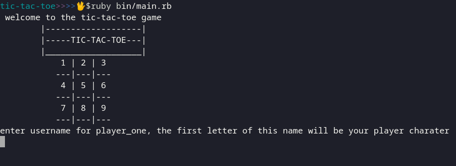

# **OOP with Tic-Tac-Toe**

This a recreation of the classic Tic-Tac-Toe using Ruby. The project is meant to reinforce Object Oriented Programing (OOP) concepts. You can learn more about the game <a href="https://en.wikipedia.org/wiki/Tic-tac-toe" target="blank">**HERE.**</a>

## **How to play our game**

Our game is a command line game so you need to be in a terminal, or terminal like environment, to run it.

The game starts by taking in the names of 2 players and uses the first letter of their names as their player marker on the board. The board is a 3 X 3 grid and each player takes turn placing markers on the board, starting with the first player. The game ends if any player has a straight set of 3 characters horizontal, vertical or diagonal or if the board is full.

## **Rules of the game**

* A player can't play more than once during a turn.
* A player can't play in an already taken space.
* Once a winning sequence is reached, the game is over regardless of how many turns have passed
* Once the board is full, game is over.

## **Running the game**

In order to run the game, you'll need to have ruby installed locally. Check [HERE](https://www.ruby-lang.org/en/documentation/installation/) to learn how to install ruby. 

You will then have to clone or download this repo. You can use `git clone https://github.com/ibrolive/oop.git` on the terminal if you have git installed or just download it from github.

Next, navigate the directory `cd oop`. The directory has the following structure:
* An assets folder that holds the images used in the README file.
* A bin folder that holds the `main.rb` file.
* A lib folder that holds `modules` and `classes` : `board.rb`, `game_logic.rb` and `player.rb`
* A LICENSE.md and a README.md file.

To run the game, first verify that you have ruby installed by running `ruby -v` or `ruby --version` you should see something like `ruby 2.6.0p0 (2018-12-25 revision 66547) [x86_64-linux]`, based on your version and OS.

Next run `ruby bin/main.rb` or `cd bin; ruby main.rb`. This command tells ruby to run our `main.rb` file. You should be greeted with the game interface.

## **ENJOY!**

## **Contributors**

*  <a href="https://github.com/ibrolive" target="blank">Ibrahim Dauda</a>
* <a href="https://github.com/Dongmo12" target="blank">Armand Dongmo</a>
